# Project Design Document

## Section 1 - Project Description

### 1.1 Project

ESeePark - A Parking Management Application with AWS Infrastructure

### 1.2 Description

    The project is a real-time streaming parking lot management application. It includes frontend and backend services which would be deployed through AWS EC2 Window instances under a AWS VPC network system. Frontend provides user signup, login and signup confirmation flows which making use AWS Amplify to setup AWS Cognito for registration, authentication and confirmation. The user registration would invoke the AWS Lambda for passing the input user account data to the AWS DynamoDB for storage. On the other hand, Backend runs a server on listening to the Frontend request. It provides the real-time streaming data (project uses static video to pretend a live camera setup at the parking site) which retrieved from the AWS S3 bucket and performing object detection (tailor trained YOLOv12 model) on parking lot occupied and empty classification. Processed result would be destructed into a binary stream together with the data back to Frontend for display.

### 1.3 Revision History

| Date | Comment | Author|
|------|---------|-------|
|23 Mar 2025| 1st Revision  (Frontend with signup, login, email confirmation, deploy at AWS EC2, user data stored in AWS DynamoDB)| Chow, Tsz Chun Samuel|
|10 Apr 2025| 2nd Revision  (Frontend proxy server, NFS Server, backend class diagram, streaming and object detection result) | Chow, Tsz Chun Samuel|

 

## Section 2 - Overview

### 2.1 Purpose

    The project focuses on utilizing AWS services includes Cognito Authentication, Amplify frontend management, EC2 instance, VPC networking, Lambda serverless function, DynamoDB database storage, S3 data bucket usage on a Frontend to Backend application.

### 2.2 AWS Infrastructure Summary
||AWS Services|
|-|-|
|Network|VPC, Subnet, IGW, NAT, CloudWatch|
|Frontend| • Amplify : Cognito configuration setup  • Congito : Authentication system  • Lambda + DynamoDB : User account information storage  • Web application hosting|
|Backend| • EC2 : Server hosting, NFS Server (S3 File Gateway)  • Endpoint : VPC to S3, VPC to AWS storage gateway service  • S3 : Bucket storing detection model and video resources|

### 2.3 Scope

<h4><u>
    Authentication
</u></h4>

    Application authentication makes use AWS Cognito services with signup confirmation.

<h4><u>
    User Interface
</u></h4>

    Web application developed with SignUp, LogIn and Dashboard pages.

<h4><u>
    Real-Time Streaming
</u></h4>

    Static video would be used to pretend an camera infrastructure data resources from a parking site.

<h4><u>
    Object Detection
</u></h4>

    Two object classes occupied and empty (parking slot) are going to be detected and identified. Counting for these two classes are provided to display at the same time.

### 2.4 Requirements

#### 2.4.1 Functional Requirements

|  | Requirement(s) |
|------|------|
|R1| **User Authentication** &bull; Users can sign up and log in using email and password &bull; Sigup confirmation is required through entering confirmation code that send to the registration email &bull; Registered user with confirmation cancellation is able to clean up the registry in the AWS Cognito system|
|R2| **User Data Storage** &bull; Registered user having necessary data would be stored automatically to database during signup process|
|R3| **Real-Time Parking Status** &bull; Application should be able to display parking site live streaming &bull; The parking spot with “Occupied” or “Empty” status should be able to be identified together with corresponding counter &bull; User able to ON / OFF the detection|

#### 2.4.2 Non-Functional Requirements

<h4><u>Performance</u></h4>

    &bull; The application should perform smooth process of signup and login flow 
    &bull; The application should load and provide the streaming within 3 seconds

<h4><u>Maintainability</u></h4>

    The system should support easy updates and bug fixes with git repository

#### 2.4.3 Technical Requirements

||Descrptions|
|---|---|
|Hardware|**Frontend (Web Application and networking loads)** &bull; AWS Instance: t3.medium &bull; vCPUs: 2 &bull; Memory: 4Gb &bull; Network performance: Up to 5 Gps  **Frontend (NAT Gateway)** &bull; AWS Instance: t2.micro &bull; vCPU: 1 &bull; Memory: 1Gb &bull; Network performance: low to moderate  **Frontend (File Storage Gateway)** &bull; AWS Instance: m5.xlarge &bull; vCPU: 4 &bull; Memory: 16Gb &bull; Network performance: Up to 10 Gbps  **Backend (Binary socket streaming, Object Detection loads)** &bull; AWS Instance: g4dn.xlarge &bull; GPU: 1 x NVIDIA T4 Tensor Core GPU &bull; vCPUs: 4 &bull; Memory: 16 Gb |
|Software|**Frontend** &bull; Node.js, React-vite in Window Environment  **Backend** &bull; Python, YOLOv11, tailor trained object detection model|

#### 2.4.4 Estimates

|#|Descriptions|Hrs. Est.|
|-|-|-|
|1|Create Web Frontend, SignUp, LogIn, Confirmation, Dashboard Pages|4 hrs|
|2|Setup AWS Amplify with AWS Cognito, Cognito User Table, configuration, and implementation to Frontend application|4 hrs|
|3|Setup EC2 Instances and VPC, IGW networking|2 hr|
|4|Setup proper security groups, IAM roles and feature user key access|1 hr|
|5|Setup subnet, route-table, in-out bound|2 hrs|
|6|Test EC2 Instances networking and Remote Desktop |2 hrs|
|7|Testing SignUp and LogIn Flow under development device|3 hrs|
|8|Setup DynamoDB Table|0.5 hrs|
|9|Setup Lambda, policy, and data insert to DynamoDB with Test|3 hrs|
|10|Frontend AWS Lambda implementation for user data storage|3 hrs|
|11|Backend server and object detection object development|4 hrs|
|12|Object Detection YOLO model training with dataset annotation|4 hrs|
|13|Backend object detection model implementation to video test|4 hrs|
|14|Backend link to S3 bucket through NFS Server and gateway under a network drive mapping for retrieving model data and video source|6 hrs|
|15|Backend to Frontend binary WebSocket development and test |4 hrs|
|16|Frontend application to EC2 deployment|2 hrs|
|17|Backend application to EC2 deployment|3 hrs|
|18|Frontend proxy server to redirect request from public IP hosted web application to private backend|2 hrs|
||TOTAL:|53.5 hrs|

 

## Section 3 - System Architecture

### 3.1 Overview

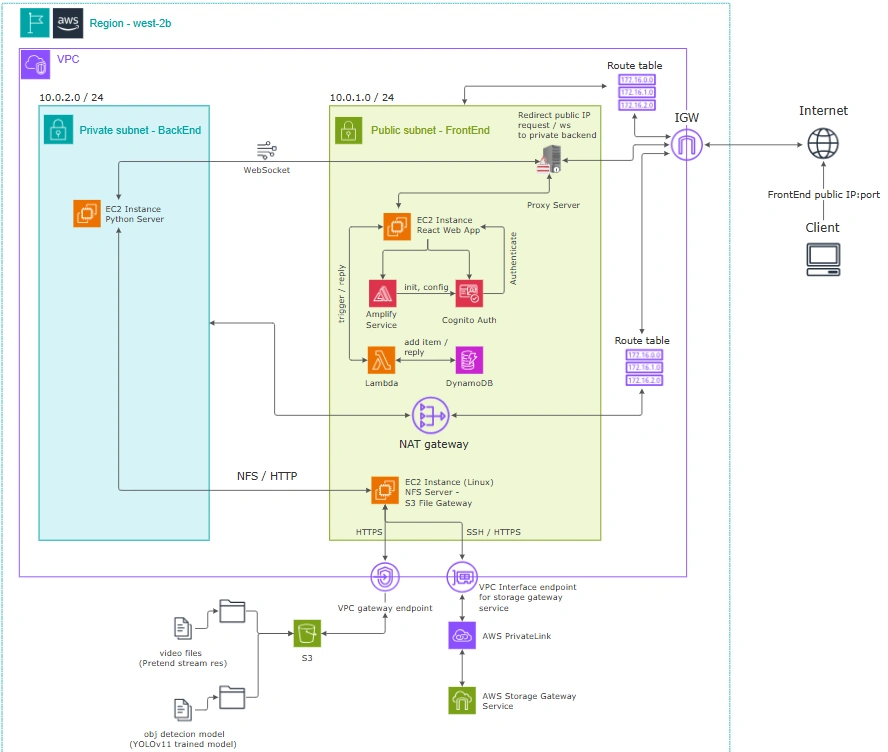

    The system introduces communication between a frontend web application and a backend server application which are deployed in a AWS EC2 instance under a private virtual cloud. Frontend is configured in a public subnet while the backend is in a private one. The public subnet routes to the internet gateway (IGW) for internet access. On the other hand, the private subnet routes to a NAT gateway for redirection to the internet.

    Frontend runs a React-Vite application under Node.js. The application uses AWS Amplify for AWS Cognito initialization and configuration. It then makes use the AWS Cognito authentication for system signup, signup confirmation and login services. Meanwhile during the signing process, user account not only registered inside the Cognito user table, but also through the AWS Lambda predesigned function to create a documentation with user information to store into a AWS DynamoDB database table as well

    At the same moment, backend runs a python server for video streaming object detection. The pretend streaming resources video files and trained AI model are stored inside the AWS S3. To let the backend server able to access the S3 bucket resources, a NFS Server is used and run under a EC2 instance under the public subnet. The NFS Server would do registration and retrieve authenication from AWS Storage Gateway Service such that mapping the target S3 bucket to the destination backend EC2 instance as a network volume.

    Under this setup, the backend server can access the S3 bucket stored resources such as the AI model for detection and the video resources, and then turn into binary data to transfer to the frontend under WebSocket connection.

 

### 3.2 Architectural Diagrams

<h3><u>Class Diagram</u></h3>

<h4><u>Overview :</u></h4>

<h4>a1) Frontend</h4>

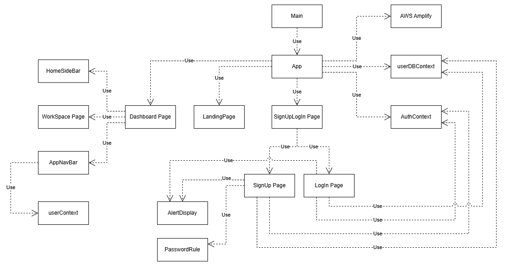

<h4>a2) Frontend (proxy server)</h4>

It just has a Express application with a created ProxyMiddleware and ProxyServer to redirect the request and websocket data to backend

<h4>a2) Backend</h4>

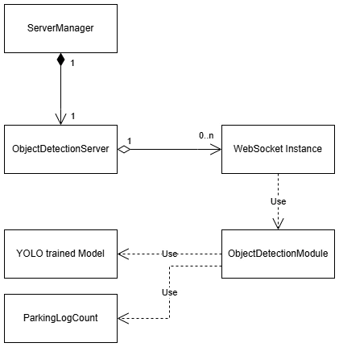

 

## Section 4 - Data Dictionary

### Server Side

<h4><u>AWS Cognito User Table</u></h4>

> |Field|Notes|Type|
> |-|-|-|
> | Username           | Entry for main id for authentication | String, email base |
> | Email address | Email address of user   | Email format |

<h4><u>AWS DynamoDB User Table</u></h4>

> |Field|Notes|Type|
> |-|-|-|
> | UserId | PrimaryKey, id synchronize to Cognito user table | String, id |
> | Email address | Email address of user | Email format|
> | Username| User preferred display name | String|
> | CreatedAt | Timestamp during iterm creation | String, timestamp|
> | UpdatedAt | Timestamp when update | String, timestamp | 

 

### Client Side (Frontend)

<h4><u>.env variable</u></h4>

> | Field | Notes | Type |
> |-|-|-|
> | VITE_COGNITO_ACCESS_KEY                 | Access key ID to AWS Cognito Service         | String |
> | VITE_COGNITO_SECRET_ACCESS_KEY          | Access key secret key to AWS Cognito Service | String |
> | VITE_LAMBDA_EXE_ACCESS_KEY              | Access key ID to AWS Lambda Service         | String |
> | VITE_LAMBDA_EXE_SECRET_ACCESS_KEY       | Access key secret key to AWS Lambda Service | String |
> | VITE_LAMBDA_EXE_ARN                     | Lambda function to access and handle DynamoDB ARN | String |
> | VITE_BACK_END_PRIVATE_IP                | Backend Private IP | String |
> | VITE_BACK_END_PORT                      | Backend Server Running Port | String |
> | VITE_FRONT_END_PUBLIC_IP                | Frontend Public IP | String |
> | VITE_FRONT_END_PROXY_SERVER_PORT        | Frontend Proxy Server Port | String |

<h4><u>SignUp Page</u></h4>

> | Field | Notes | Type |
> |-|-|-|
> | emailRef              | Email entry                                           | useRef(String)        |
> | userNameRef           | Username entry                                        | useRef(String)        |
> | passwordRef           | Password entry                                        | useRef(String)        |
> | passwordConfirmRef    | Confirm password entry                                | useRef(String)        |
> | emailConfirmCodeRef   | Confirm email code entry                              | useRef(String)        |
> | currentUser           | Current User Object from AuthContext                  | Object info           |
> | isLoadingUser         | Flag checking if AuthContext performs authentication  | useState(Boolean)     |
> | isLoadingUserDB       | Flag checking if user database is refreshing          | useState(Boolean)     |
> | alertUserDB          | Information of the process when success or fail       | Object info           |
> | isStartSignUp         | Flag raised for signing up process                    | useState(Boolean)     |
> | messageObj           | Local use display message                              | useState(Object)      |
> | errorMessage         | Display error message                                  | useState(String)      |
> | isDisplayConfirmIcon | UI control display                                    | useState(Boolean)     |
> | isPSConfirmOK        | Flag checking if password confirmation was successful | useState(Boolean)     |
> | showPassword             | Flag for UI password textfield display                      | useState(Boolean)     |
> | showConfirmPassword      | Flag for UI confirm password textfield display              | useState(Boolean)     |
> | openConfirmDialog        | Flag control for UI open confirm dialog                     | useState(Boolean)     |
> | openProceedYesNoDialog   | Flag control for UI open proceed Yes/No dialog              | useState(Boolean)     |
> | currentPendingUser       | Object storing user registry info before confirmation       | useState(Object)      |

<h4><u>Login Page</u></h4>

> | Field | Notes | Type |
> |-|-|-|
> | emailRef          | Email entry                                           | useState(String)      |
> | passwordRef       | Password entry                                        | useState(String)      |
> | currentUser       | Current User Object from AuthContext                  | Object info           |
> | isLoadingUser     | Flag checking if AuthContext performs authentication  | useState(Boolean)     |
> | isLoadingUserDB   | Flag checking if user database is refreshing          | useState(Boolean)     |
> | alertUserDB       | Information of the process when success or fail       | Object info           |
> | isStartLogIn      | Flag raised for logging in process                    | useState(Boolean)     |
> | messageObj        | Local use display message                             | useState(Object)      |
> | errorMessage      | Display error message                                 | useState(String)      |
> | showPassword      | Flag for UI password textfield display                | useState(Boolean)     |

 

 

## Section 5 - User Interface Design

### 5.1 User Interface Design

Landing Page / LogIn

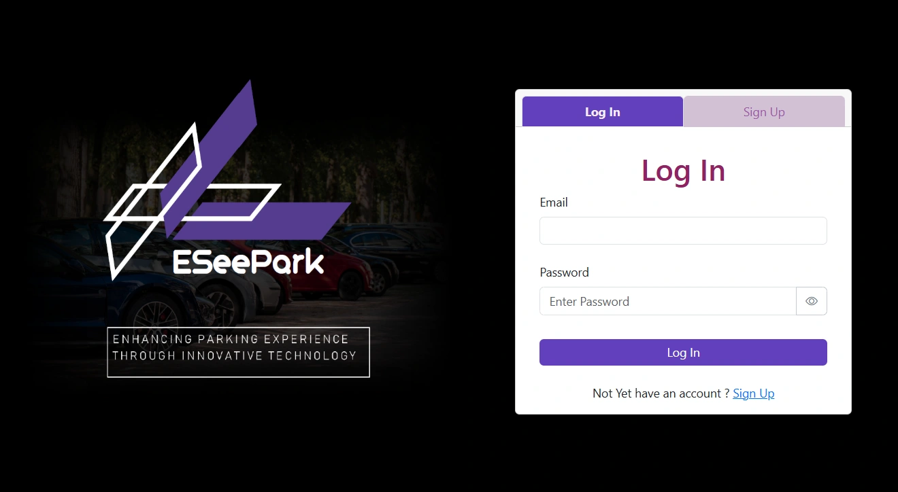

### 5.2 User Interface Navigation Flow

SignUp Page

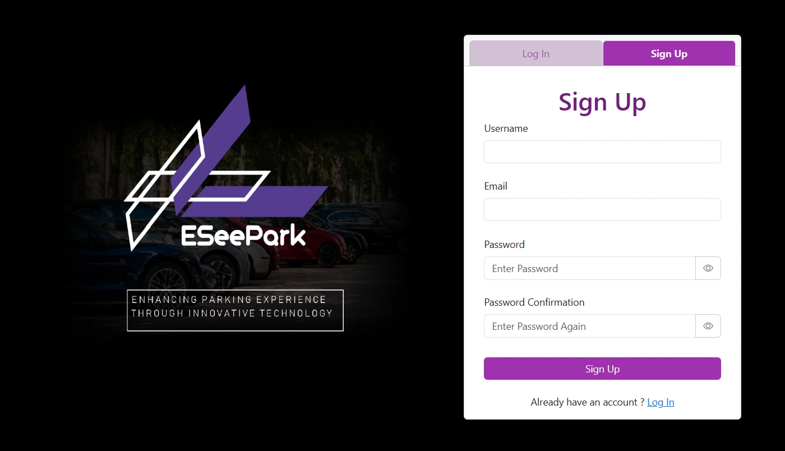

Main Dashboard

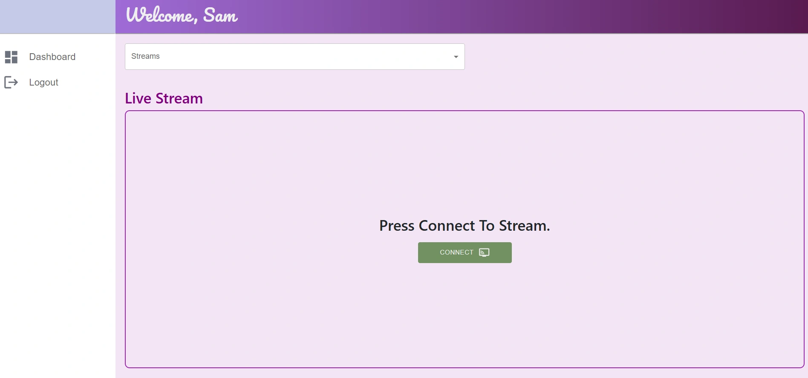

Streaming Board

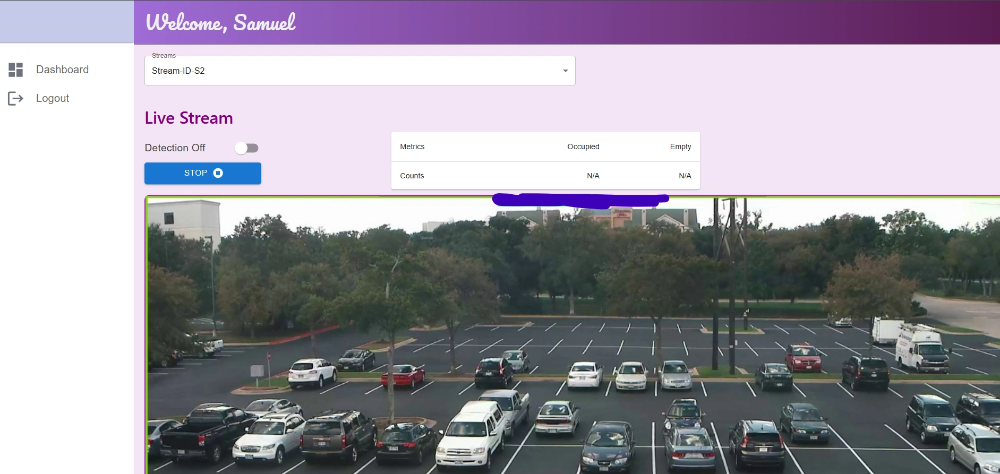

### 5.3 Use Cases / User Function Description
 
Password Confirm Check - NG

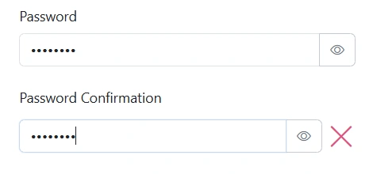

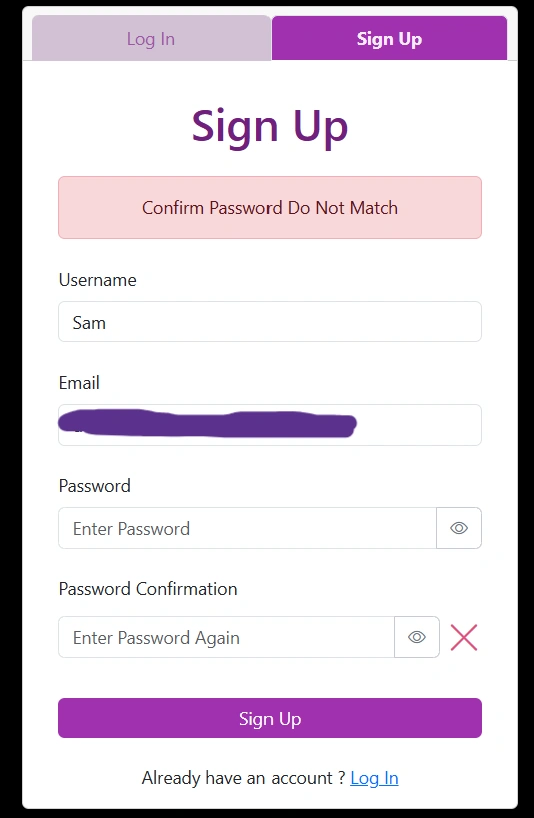

Password Confirm Check - OK

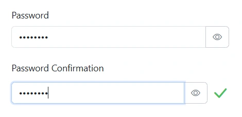

Email Confirmation Code Entry

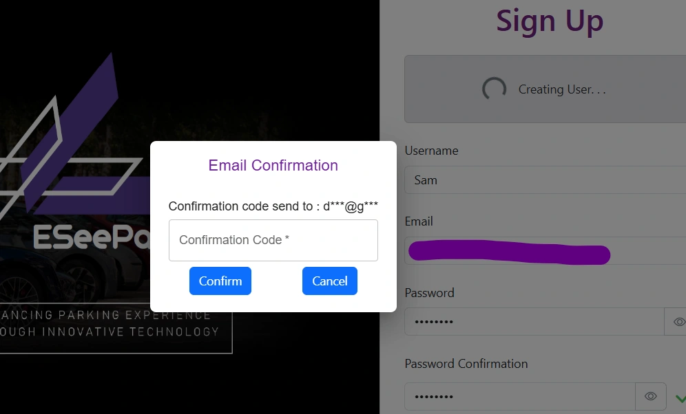

Streaming Detection On / OFF and Metrics

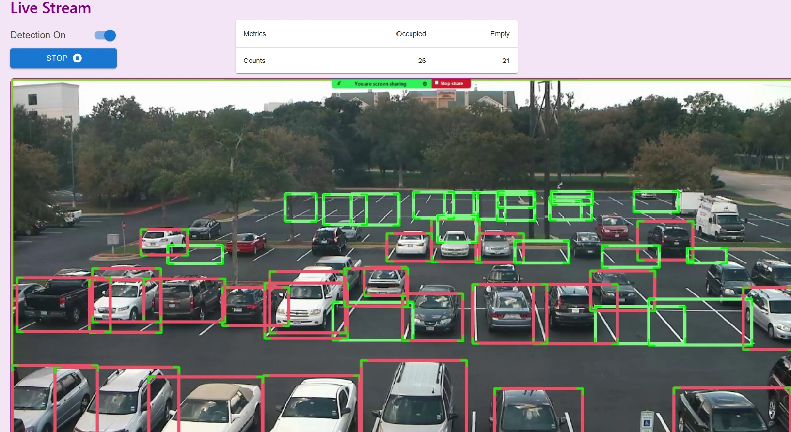

 

<h3 style="text-align:center;">END of Document</h3>
